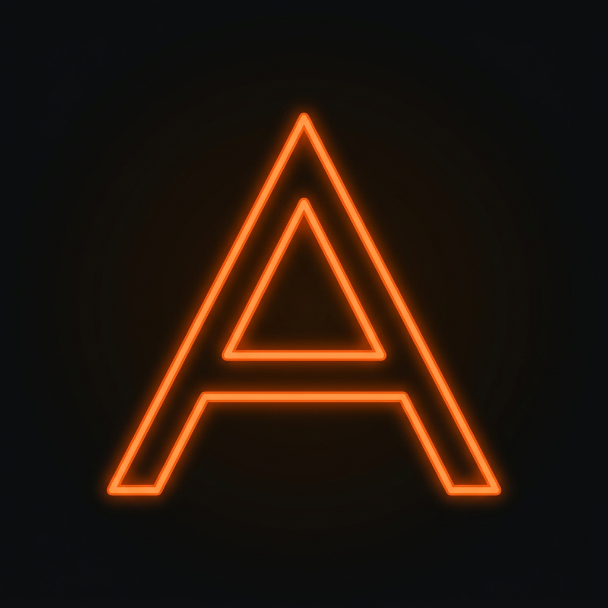

  
  <h1>Aryan's Professional Portfolio</h1>
  
<strong>A Modern, High-Performance Showcase of AI Engineering & Web Development</strong>

 

  
  
  
  
  

## 🌐 Live Website
**View the active deployment here**:(https://aryan-portfoilio.vercel.app/)

## 🚀 Overview
Welcome to my personalized digital portfolio perfectly merging modern neon-gradient aesthetics with ultra-responsive UX. 
This portfolio was built purely to act as a blazing-fast, accessible hub representing my journey in **Machine Learning**, **Data Science**, **Cloud Engineering (AWS)**, and **Software Architecture.**

## 🌟 Key Highlights
- **Stunning UI/UX**: Full Dark-Mode design with premium neon-orange accents, complex glassmorphism styling, and custom floating cursors designed completely without relying on bulky frontend libraries!
- **AI Engineered Content**: Sections tailored around cutting-edge technical achievements such as Retrieval-Augmented Generation (RAG) pipelines, LangChain orchestration, and large-scale Python inference environments.
- **Flawless Optimization**: Entire site runs without loading external layout packages, dropping page-weight significantly for instant interactivity.

## 🛠 Project Breakdown
The layout relies strictly on lightweight code to keep transitions snappy:
* `index.html` - The beating heart of the website encompassing all semantic tags and interactive Javascript logic.
* `favicon.png` - Crisp geometric minimalist logo icon serving as the site's distinct branding.
* `my_photo.jpg` & `my_resume.pdf` - Professional assets locally integrated for zero-latency loading.

## 📱 Features
1. Custom Marquee Auto-Scrolls featuring specific technology loops.
2. Complete interactive pop-up contact integration connected to secure forms.
3. Interactive grid tracking expertise across Langchain, FastAPI, ChromaDB, Huggingface Transformers, and Git Operations.

## 🚀 Live Deployment
This project is built directly to integrate perfectly with **Vercel** for continuous high-speed edge delivery. 
To deploy your own fork instance automatically: 
1. Link your repo locally using the Vercel CLI, OR 
2. Go to **vercel.com/new**, authenticate via GitHub, and single-click deploy!

## 📝 License
This project is open-source and available under the **MIT License**. Feel free to fork and use it as a foundation for your own portfolio!

---

  Crafted with ❤️ by Aryan Khatri  
  <i>(2024 AI Engineer Portfolio)</i>

